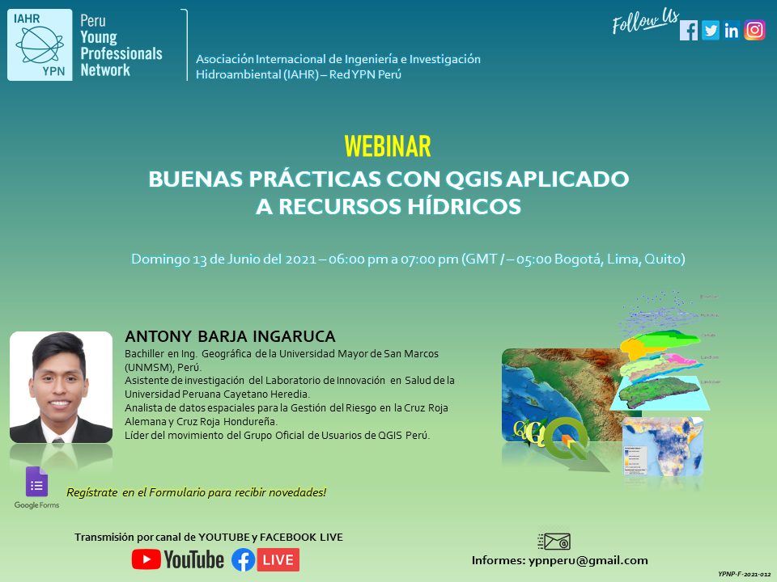

<h1><p align = "center"><b>Buenas prácticas con QGIS aplicado a Recursos Hídricos</b></p></h1>
<p align="center">
  <a href="https://github.com/ambarja/Buenas-practicas-con-QGIS/discussions/new">
   
  </a>
  <a href="https://github.com/qgispe">
   
  </a>
  <a href="https://www.linkedin.com/in/antonybarja/">
   
  </a>
  <a href="https://twitter.com/antony_barja">
   
  </a>
  <a href="https://www.youtube.com/channel/UCuWvYTTYCZBmbDoEbsY2MSw">
    
  </a>
</p>

---

### **LISTA DE CONTENIDO**
 - Introducción a QGIS
 - Instalación de QGIS en **Windows**, **GNU/Linux** y **Mac
  OS**
 - Configuración inicial
 - Instalación de plugins indespensable
 - Mi primer proyecto
 - Explorando las herramientas de análisis hidrológico (**SAGA**)
 - Elaboración y diseño de mapas
 - Visualización de datos en 3D
 - Publicación de mapas web
 - Novedades para **QGIS 3.20 - Odense**

---
### **RECURSOS**
* Materiales - [**descargar** ⏬ ](https://github.com/ambarja/Buenas-practicas-con-QGIS/raw/main/materiales/materiales.tar.xz)
* Proyecto reproducible - [**descargar** ⏬](https://github.com/ambarja/Buenas-practicas-con-QGIS/raw/main/materiales/hydroQGIS.tar.xz)


**Plugins adicionales**
```
url: https://plugins.bruy.me/plugins/plugins.xml
```


**Raster value**
```
 raster_value('dem',1,$geometry)
```
**Creación de patches**
```
geom_to_wkt($geometry,2)
```

**Patches - Hydrobasin**

```
MultiPolygon (((489079.25 8679085.5, 487754 8679426.5, 487738.5 8680077.5, 487955.5 8680496, 487692 8680728.5, 487583.5 8681317.5, 488234.5 8681906.5, 488591 8683239.5, 489800 8683921.5, 490249.5 8685316.5, 489893 8685812.5, 489893 8686184.5, 490373.5 8686432.5, 490900.5 8686417, 491458.5 8686851, 491954.5 8686990.5, 492574.5 8686231, 493613 8685440.5, 494248.5 8683999, 494062.5 8683658, 494791 8682898.5, 494961.5 8682480, 494372.5 8681302, 494527.5 8680666.5, 494388 8680232.5, 493814.5 8680077.5, 493070.5 8680155, 492559 8679271.5, 491815 8679488.5, 490885 8679364.5, 490327 8679612.5, 489598.5 8679504, 489079.25 8679085.5)))

```
---
### **DESCRIPCIÓN**

El objetivo de este taller es introducir a los nuevos usuarios a las buenas prácticas de empleabilidad de QGIS para tener una forma más amigable de trabajar con este
software de Sistema de Información Geográfica libre y
 de código abierto.




### **FECHA-LUGAR-TIEMPO**
 * 📅 20/06/2021
 * 🔵 Online
 * ⌚ 18:00 pm - Perú

### **PLATAFORMA - SOFTWARE**
 *  Yotube
 *  QGIS

### **REFERENCIAS**

 * [**QGIS and Applications in Water and Risks**](https://www.wiley.com/en-cr/QGIS+and+Applications+in+Water+and+Risks-p-9781786302717)
 * [**QGIS for Hydrological Applications**](https://locatepress.com/hyd)

### **CONTACTO**
* 🤓 **Antony Baja** (  <b>antony.barja@qgispe.org</b>)
  - [Miembro oficial del **Grupo de Usuarios de QGIS Perú**] (https://github.com/qgispe)
  - [Líder de **OpenDroneMap-Perú**](https://www.facebook.com/groups/1467793856763738)
  - [Investigador de **Inovalab-UPCH**](https://www.innovalab.info/)

